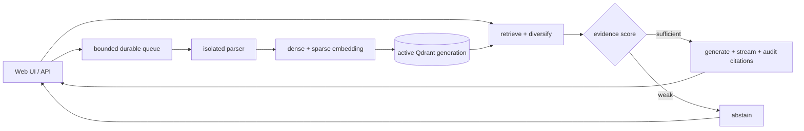

<div align="center">

# 🌾 Reed

**Reed has read your documents.**

A local-first RAG service: upload documents, ask questions, and receive streamed answers with
clickable citations. Use OpenAI, or keep documents, questions and answers on your own machine with
Ollama.

[](https://github.com/Ulzuhan/reed/actions/workflows/ci.yml)
[](https://github.com/Ulzuhan/reed/pkgs/container/reed)
[](https://github.com/Ulzuhan/reed/releases/latest)
[](https://www.python.org/)
[](https://docs.astral.sh/ruff/)
[](https://mypy-lang.org/)
[](LICENSE)


</div>

---

## Why Reed

The difficult part of document QA starts after a demo produces an answer: did retrieval find the
exact evidence, did the model cite it, does the system abstain when evidence is weak, and can an
index change be rolled back without serving mixed vectors?

Reed makes those properties explicit:

- **Hybrid retrieval** combines dense embeddings with BM25 sparse vectors through Qdrant RRF.
- **Evidence-aware refusal** rejects weak retrieval before generation. The default local
  EmbeddingGemma/hybrid threshold is calibrated from the shipped golden set; other score domains
  remain unthresholded until the operator calibrates them.
- **Citations are audited** for source range, sentence coverage, cited figures and verbatim quotes.
  Deterministic checks are regression guards, not proof of semantic entailment.
- **Safe index generations** build in a new physical collection, verify committed counts, switch
  atomically, retain a compatible rollback generation and never mix embedding identities.
- **Reproducible evaluation** ships 41 questions, exact evidence labels, negative, multi-hop,
  cross-language, conversational and adversarial cases, bootstrap intervals and full provenance.
- **Durable bounded ingestion** exposes `queued → parsing → embedding → indexing → ready`, resumes
  queued work after restart and returns backpressure instead of growing an unbounded task list.
- **Local operation** works with embedded Qdrant and Ollama. Docker is optional.

## How it works



Retrieval and generation are two explicit steps, not an agent loop. This keeps latency predictable
and lets evaluation exercise the same code path as the API.

## Quickstart without Docker

You need [uv](https://docs.astral.sh/uv/). Local mode also needs
[Ollama](https://ollama.com).

```bash
git clone https://github.com/Ulzuhan/reed.git
cd reed
uv sync
```

Fully local:

```bash
ollama pull qwen3.5:4b
ollama pull embeddinggemma
REED_PROFILE=local uv run reed serve
```

OpenAI:

```bash
export OPENAI_API_KEY=sk-...
REED_PROFILE=openai uv run reed serve
```

Open <http://localhost:8000>. Embedded Qdrant stores data under `./data`; no separate database
process is required. Files can also be ingested from the CLI:

```bash
uv run reed ingest ./my-documents/
```

## Docker Compose

OpenAI profile:

```bash
OPENAI_API_KEY=sk-... docker compose up -d --wait
```

Fully local stack:

```bash
docker compose --profile ollama up -d --wait
docker compose exec ollama ollama pull qwen3.5:4b
docker compose exec ollama ollama pull embeddinggemma
REED_PROFILE=local docker compose up -d --wait
```

The image is published for `linux/amd64` and `linux/arm64`. Pin
`ghcr.io/ulzuhan/reed:0.5.1` or its digest for reproducible deployments. Compose binds the API to
loopback, uses a read-only root filesystem, drops capabilities, enables `no-new-privileges`, and
sizes `/tmp` to 64 MiB by default. The upload spool and Reed's staged file can coexist briefly, so
keep `REED_TMPFS_SIZE` above approximately `2 × REED_MAX_UPLOAD_MB` plus multipart overhead.

## Supported deployment boundary

Reed is a **single-node service**. Run one API process against one registry and one active
index. Its queue, rate limits, locks and metrics are per process; multiple Uvicorn workers or
several Reed replicas are not a supported high-availability topology. Remote Qdrant is supported
for storage, but does not turn the SQLite registry or ingestion queue into distributed state.

Before exposing Reed beyond loopback, configure a strong ASCII `REED_API_KEY`, TLS and
authentication at a reverse proxy, exact `REED_CORS_ORIGINS`, and proxy-level rate limits. One Reed
API key grants access to every document in that instance; Reed is not a multi-tenant authorization
system.

## API and UI

Interactive API documentation is at `/docs`.

| Method | Path | Purpose |
|---|---|---|
| `GET` | `/health` | Fast liveness plus cached chat-provider state |
| `GET` | `/ready` | Vector-store readiness; `503` while unavailable |
| `GET` | `/metrics` | Prometheus text metrics; API-key protected when auth is enabled |
| `POST` | `/v1/documents` | Queue a PDF, DOCX, HTML, Markdown or text upload; returns `202` or `503` with `Retry-After` |
| `GET` | `/v1/documents` | Paginated document list and ingestion stage |
| `PUT` | `/v1/documents/{logical_id}` | Publish new content for a document; returns `202` |
| `GET` | `/v1/documents/{id}` | One document; poll until `ready` or `error` |
| `GET` | `/v1/documents/{logical_id}/versions` | Every version, newest first |
| `DELETE` | `/v1/documents/{logical_id}/versions/{n}` | Forget one superseded version |
| `DELETE` | `/v1/documents/{id}` | Delete a ready/error document and its committed chunks |
| `POST` | `/v1/ask` | SSE by default, JSON with `"stream": false` |
| `POST` | `/v1/search` | Ranked evidence with no generation, for callers whose own model answers |

`GET /v1/*` and metrics responses are marked `Cache-Control: no-store`. The UI reports upload
progress and ingestion stages, renders structured API errors, and lets the user stop an in-flight
answer stream.

`/v1/search` returns the same numbered `sources` as `/v1/ask` and nothing built on top of them —
no answer, no citation audit. It reports the evidence threshold rather than applying it
(`sufficient_evidence`, `min_evidence_score`), because a caller whose own model does the
generation needs the scores to decide with; `/v1/ask` still abstains on weak evidence. It has its
own rate-limit bucket, `REED_SEARCH_RATE_LIMIT_PER_MINUTE`, since retrieval costs one embedding
call rather than a generation, and its own retrieval-thread budget,
`REED_MAX_CONCURRENT_SEARCHES`, so a burst of searches queues against itself rather than taking
the threads uploads and `/v1/ask` need.

Uploads are idempotent by content SHA-256. Reed validates body and document limits before expensive
work, parses in a spawned process with wall-clock and Linux resource limits, embeds outside the
Qdrant lock, and publishes chunks only after the complete batch commits.

## Use it from an AI assistant

[`reed-mcp`](https://github.com/Ulzuhan/reed-mcp) exposes a running Reed to any
[MCP](https://modelcontextprotocol.io) host — Claude Desktop, Claude Code — as four read-only
tools. The assistant retrieves through `/v1/search` and writes the cited answer with its own
model; documents, questions and retrieval all stay on the machine.

```bash
claude mcp add reed -- uvx --from git+https://github.com/Ulzuhan/reed-mcp@v0.1.0 reed-mcp
```

It needs Reed 0.5.0 or newer, which is where `/v1/search` first shipped.

## Safe index changes

The collection fingerprint includes dense model name, immutable digest/revision, quantization,
dimension, task prefixes, sparse model, chunking configuration and the extraction pipeline
version. A mismatch is rejected instead of silently mixing incompatible vectors.

```bash
uv run reed index status
uv run reed index reindex
uv run reed index rollback
uv run reed index cleanup --keep 2
```

`reindex` reads the retained uploaded originals, checks each SHA-256, builds an isolated candidate,
verifies its committed document/chunk counts and then changes the registry pointer atomically. A
failed candidate is marked failed and removed while the current generation keeps serving. To roll
back after a model/configuration change, first restore the exact previous fingerprint; incompatible
generations are deliberately refused. See [the runbook](docs/runbooks.md).

Upgrading from an earlier release: every index built before v0.4 mismatches the fingerprint on
upgrade, because the extraction pipeline version is now part of it. Stop Reed, keep a backup,
install the current release and run `reed index reindex`; the previous generation stays available
for rollback.
Do not delete the old collection before the new generation has been activated and verified.

## Evaluation 2.0

The installed wheel contains its evaluation corpus, golden questions and evidence labels, so the
CLI also works from an empty current directory:

```bash
uv run reed eval --retrieval-only
uv run reed eval --retrieval-only --mode dense
uv run reed eval --retrieval-only --mode sparse
uv run reed eval --retrieval-only --mode hybrid
uv run reed eval --judge local
uv run reed eval --judge openai
```

Retrieval reports exact chunks, scores, matched evidence, Recall@k, nDCG@k, MRR, full multi-hop
coverage, negative abstention, overall abstention accuracy, deterministic 95% bootstrap intervals
and a calibrated threshold recommendation. Generation reports preserve metric coverage—failed
judge calls are neither cached nor silently converted to zero—and include citation status and
warnings. Provenance records dataset hashes, git SHA, packages, hardware, model
digest/revision/quantization, prefixes, chunking and retrieval configuration.

### Default embedding decision

The v0.3 A/B used the same 10-document corpus, 41 questions, exact evidence, hybrid configuration
and no reranker. Higher is better except latency/time.

| Model | Recall@k | nDCG@k | MRR | all evidence | median retrieval | run time |
|---|---:|---:|---:|---:|---:|---:|
| **EmbeddingGemma BF16** | **69.0%** | **0.606** | **0.638** | **62.9%** | **77 ms** | **8.23 s** |
| Qwen3-Embedding 0.6B Q8_0 | 66.2% | 0.570 | 0.617 | 57.1% | 85 ms | 11.09 s |

EmbeddingGemma remains the default because Qwen was not better on this corpus and was slower. The
full methodology, immutable digests, confidence intervals and non-marketing decision record are in
[the A/B report](eval/results/embedding-ab-v0.3.md).

Qwen remains an opt-in multilingual preset:

```bash
ollama pull qwen3-embedding:0.6b
REED_PROFILE=local \
REED_OLLAMA_EMBED_MODEL=qwen3-embedding:0.6b \
REED_MIN_EVIDENCE_SCORE=0.6666666666666666 \
uv run reed index reindex
```

The prefix is selected automatically. Evaluate on the real target corpus before adopting any
model or threshold.

### Optional multilingual reranking

Reranking is off by default and isolated behind an adapter. Install the optional dependencies,
then re-evaluate latency and quality:

```bash
uv sync --extra rerank
REED_RERANK_ENABLED=true uv run reed serve
```

The default reranker is `BAAI/bge-reranker-v2-m3` through Sentence Transformers; a FastEmbed
backend can instead use a model in its own registry, for example
`REED_RERANK_BACKEND=fastembed` with
`REED_RERANK_MODEL=jinaai/jina-reranker-v2-base-multilingual`. Reranker scores are a different
score domain, so Reed does not reuse the RRF abstention threshold automatically.

## Configuration

Every setting is a `REED_*` environment variable or a line in `.env`; see
[`.env.example`](.env.example) for the complete list. Important controls:

| Variable | Default | Notes |
|---|---|---|
| `REED_PROFILE` | `openai` | `openai`, `local` or deterministic `fake` |
| `REED_OLLAMA_EMBED_MODEL` | `embeddinggemma` | Qwen preset is opt-in |
| `REED_QDRANT_URL` | empty | Empty selects embedded Qdrant |
| `REED_RETRIEVAL_MODE` | `hybrid` | `dense`, `sparse`, `hybrid`, `hybrid_rerank` |
| `REED_TOP_K` / `REED_FETCH_K` | `4` / `20` | Final evidence and rerank candidate counts |
| `REED_MIN_EVIDENCE_SCORE` | automatic | `0.8333333333333333` only for default local Gemma hybrid RRF; otherwise `0` |
| `REED_MAX_CHUNKS_PER_DOCUMENT` | `2` | Diversity cap per source document |
| `REED_CHUNK_SIZE` / `REED_CHUNK_OVERLAP` | `1000` / `150` | Characters, fingerprinted |
| `REED_MAX_CONCURRENT_INGESTIONS` | `2` | Worker threads in the single process |
| `REED_MAX_QUEUED_INGESTIONS` | `16` | Durable queue backpressure boundary |
| `REED_MAX_CONCURRENT_ASKS` | `8` | Concurrent generation boundary |
| `REED_MAX_CONCURRENT_SEARCHES` | `16` | Retrieval threads for `/v1/search`, separate from the pool uploads and `/v1/ask` draw on |
| `REED_SEARCH_RATE_LIMIT_PER_MINUTE` | `120` | Per-client budget for `/v1/search` |
| `REED_MAX_UPLOAD_MB` | `25` | Enforced at stream and staging layers |
| `REED_API_KEY` | empty | Requires `X-API-Key` on protected endpoints when set, and stops the deployment from naming its version, profile and models |
| `REED_DATA_DIR` | `./data` | Registry, uploads and embedded Qdrant; created `0700` |

## Operations and security

Create backups only while Reed is stopped:

```bash
uv run reed backup create ../reed-backup.tar.gz
uv run reed backup verify ../reed-backup.tar.gz
uv run reed backup restore ../reed-backup.tar.gz
```

Archives carry a schema, Reed version and SHA-256 for every file; verification and restoration
reject traversal, links and unsafe member types. Restore targets must be empty. Embedded Qdrant is
included under `REED_DATA_DIR`; a remote Qdrant deployment requires its own coordinated snapshot.
Detailed backup, restore, recovery and monitoring procedures are in
[the operations runbook](docs/runbooks.md).

The parser process limits reduce blast radius but are not a complete OS sandbox. Treat documents,
model output and citations as untrusted. See [SECURITY.md](SECURITY.md) for the deployment boundary
and private vulnerability reporting.

## Development

```bash
make install
make lint
make type
make test
make test-coverage
make eval
```

Tests use deterministic fake dense embeddings with real embedded Qdrant and real FastEmbed BM25.
CI covers Python 3.11–3.14, strict mypy, Ruff, global and critical-module branch gates, dependency
and history scanning, Chromium UI behavior, container scanning, a full Compose upload-to-answer
smoke test and a backup/restore round trip into a freshly created volume. Release artifacts are
rebuilt from the source distribution and smoke-tested from an empty directory.

## Current limitations

- Single-node only; no distributed ingestion claims or multi-tenant authorization.
- PDF, DOCX, HTML, Markdown and plain text only; OCR for scanned documents is not included, so
  run those through an OCR tool before uploading. A fully scanned PDF is rejected with a clear
  error. A mostly scanned PDF that still contains a little extractable text — a cover page,
  headers — ingests only that text, without a warning.
- DOCX extraction applies tracked changes and ignores comments and footnotes.
- HTML extraction drops scripts and anything hidden by an inline style, the `hidden`
  attribute or `aria-hidden`. Text hidden by a stylesheet rule is not detected: Reed parses
  HTML, it does not apply CSS.
- One logical corpus per Reed instance. A document keeps its version history, but Reed is not
  a general content-versioning system: only the current version is searchable, and superseded
  versions are retained rather than pruned on a schedule.

## License

Reed v0.3 and later are licensed under [Apache License 2.0](LICENSE). The immutable v0.1.x and
v0.2.x release/tag contents remain available under the MIT license that accompanied those
versions. Model weights are not redistributed and have separate terms; see
[model and component licenses](docs/models.md).

---

<div align="center">
Built by <a href="https://hesperialabs.com">Hesperia Labs</a> — local-first, privacy-first AI.
</div>
