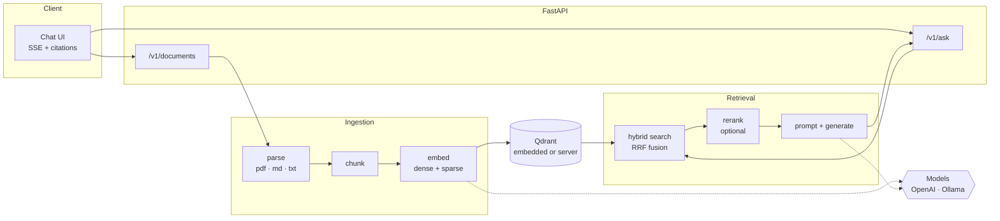

<div align="center">

# 🌾 Reed

**Reed has read your documents.**

A self-hosted RAG service: upload your files, ask questions, get streamed answers with citations
you can click. Runs on the OpenAI API — or entirely on your own machine, where nothing you upload
ever leaves it.

[](https://github.com/Ulzuhan/reed/actions/workflows/ci.yml)
[](https://github.com/Ulzuhan/reed/pkgs/container/reed)
[](https://www.python.org/)
[](https://docs.astral.sh/ruff/)
[](https://mypy-lang.org/)
[](LICENSE)


</div>

---

## Why this exists

Most RAG demos stop at "it answered something". The interesting problems start after that: does it
answer from the documents or from the model's memory, does it admit when the documents are silent,
does it find the right passage when the question does not share vocabulary with the answer, and can
you prove any of it changed when you tune a parameter.

Reed is built around those questions. It ships a **hybrid retriever**, a **strict citation
contract**, and an **evaluation suite with a golden question set** so every change to chunking,
retrieval or prompting can be measured rather than guessed at.

## Features

- **Hybrid retrieval** — dense embeddings and BM25 sparse vectors searched together, fused by
  Qdrant with Reciprocal Rank Fusion. Paraphrases and exact terminology both find their passage.
- **Citations that mean something** — the model is instructed to mark every claim with `[n]`; Reed
  marks unknown references invalid, flags uncited sentences and checks cited figures and verbatim
  quotes against the exact chunks retrieved. The UI turns references into clickable chips.
- **Calibrated refusal** — when the documents do not answer the question, saying so is the correct
  behaviour, and the evaluation suite measures whether it happens.
- **Fully local mode** — with Ollama, no document, question or answer leaves your machine.
- **Token streaming** over Server-Sent Events, with sources delivered before the first token.
- **Built-in evaluation** — retrieval-only runs with no chat or judge, plus LLM-judged answer
  quality that can itself run locally.
- **Runs without Docker** — embedded Qdrant means `uv sync` and go. Or bring the compose stack.
- **Optional reranking** with a local ONNX cross-encoder when accuracy matters more than latency.

## How it works



Retrieval and generation are two explicit steps rather than an agent loop. For document question
answering that is the right trade: the flow is predictable, streams cleanly, and the evaluation
measures exactly the path users take.

## Quickstart — no Docker

You need [uv](https://docs.astral.sh/uv/) and, for the local profile,
[Ollama](https://ollama.com).

```bash
git clone https://github.com/Ulzuhan/reed.git && cd reed
uv sync
```

**Fully local** — nothing leaves your machine:

```bash
ollama pull qwen3.5:4b && ollama pull embeddinggemma
REED_PROFILE=local uv run reed serve
```

**With OpenAI**:

```bash
export OPENAI_API_KEY=sk-...
REED_PROFILE=openai uv run reed serve
```

Either way, open <http://localhost:8000>, drop in a PDF or Markdown file, and ask.

Qdrant runs embedded — a folder under `./data`, no server, no container. Ingest from the command
line instead of the browser with `uv run reed ingest ./my-docs/`.

## Quickstart — Docker

```bash
OPENAI_API_KEY=sk-... docker compose up
```

Or the fully local stack, with Ollama in the compose file too:

```bash
docker compose --profile ollama up -d
docker compose exec ollama ollama pull qwen3.5:4b
docker compose exec ollama ollama pull embeddinggemma
REED_PROFILE=local docker compose up -d
```

The published image is `ghcr.io/ulzuhan/reed:latest` (linux/amd64 and linux/arm64).
Compose binds it to `127.0.0.1` by default. Before exposing Reed through a LAN, public IP or
reverse proxy, set a strong ASCII `REED_API_KEY`, configure TLS at the proxy and set
`REED_CORS_ORIGINS` to the exact browser origins that need access. The built-in request limits are
per process; multi-worker deployments should also rate-limit at the proxy.

Document bodies are authenticated, rate-limited and size-checked before FastAPI parses multipart
or JSON content. Parsing then runs in a spawned process with a wall-clock deadline and, on Linux,
CPU, address-space and file-descriptor limits. The provided container adds a read-only root
filesystem, dropped capabilities and `no-new-privileges`; third-party build/service images are
pinned by digest and refreshed by Dependabot. For immutable deployments, set `REED_IMAGE` or edit
Compose to use a published Reed digest instead of the convenient `latest` default.

### Upgrading an existing installation

Collections created before Reed recorded its full vector fingerprint are intentionally rejected:
their embedding model, task prefixes, sparse configuration and chunking settings cannot be proven
compatible. Set `REED_COLLECTION` to a new name—or remove the old embedded/remote collection—and
reingest the source documents. The SQLite document registry migrates automatically. Configured
`REED_API_KEY` values must now contain ASCII characters only.

## API

Interactive documentation lives at `/docs`. If `REED_API_KEY` is set, every `/v1` route requires an
`X-API-Key` header.

| Method | Path | What it does |
|---|---|---|
| `GET` | `/health` | Fast liveness status; detail is hidden when auth is enabled |
| `GET` | `/ready` | Dependency readiness; returns `503` while the vector store is unavailable |
| `POST` | `/v1/documents` | Upload a PDF, Markdown or text file — returns `202` and ingests in the background |
| `GET` | `/v1/documents` | Paginated list (`limit`, `offset`) with status and chunk counts |
| `GET` | `/v1/documents/{id}` | One document — poll this while it ingests |
| `DELETE` | `/v1/documents/{id}` | Remove a document and every chunk it produced |
| `POST` | `/v1/ask` | Ask a question — SSE stream by default, JSON with `"stream": false` |

Ingestion is idempotent, keyed on the file's SHA-256, so uploading the same content twice returns
`409` with the existing document id. Deleting a document while it is still being ingested returns
`409` too — removing it mid-run would leave its chunks behind, retrievable and citable for a
document the API no longer knows about.

Startup never waits for a full provider timeout. Vector-store initialization runs single-flight in
the background; `/ready` stays fast, retries with exponential backoff, and costly POST endpoints
return `503` with `Retry-After` until the store is usable. A collection fingerprint mismatch remains
a fatal configuration error because retrying cannot make incompatible vectors safe.

### Streaming a question

```bash
curl -N -X POST http://localhost:8000/v1/ask \
  -H 'content-type: application/json' \
  -d '{"question": "What is the expense pre-approval threshold?"}'
```

```
event: meta
data: {"request_id":"r-a37fc81c6b3b","profile":"local","model":"qwen3.5:4b"}

event: sources                     ← retrieval finishes before generation starts,
data: {"sources":[{"n":1,"doc_id":"d-10d30e7a…","filename":"expenses.md",
       "page":null,"score":0.87,"snippet":"Expenses above 75 euros require…",
       "excerpt":"Expenses above 75 euros require pre-approval."}]}

event: token                       ← one per chunk from the model
data: {"t":"Expenses above 75 euros "}

: ping                             ← heartbeat, so proxies do not buffer the stream

event: done
data: {"answer":"Expenses above 75 euros require pre-approval [1].","latency_ms":2145,
       "context_chars":309,"citation_status":"valid","citation_warnings":[]}
```

The `n` in each source is the same number the model is told to cite with, which lets a client render
`[1]` as a link to the complete retrieved passage. Retrieved excerpts are serialized as untrusted
JSON in a user-level message—never interpolated into the system message. Reed checks source ranges,
sentence-level citation coverage, cited figures and verbatim quotes. Those deterministic checks are
strong regression guards, not proof of semantic entailment; the optional evaluation judge measures
deeper faithfulness.

## Evaluation

`eval/corpus/` holds a synthetic company handbook, and `eval/golden.jsonl` holds 30 questions with
reference answers and the documents that genuinely answer them — including `negative` questions the
handbook does not cover, where the correct behaviour is refusal.

```bash
uv run reed eval --retrieval-only    # embeddings only; no chat or judge
uv run reed eval --judge local       # judged by your own Ollama model
uv run reed eval --judge openai      # judged by the OpenAI API
```

**Retrieval metrics** are plain arithmetic over the ranked results:

- `hit@1` / `hit@k` — was an expected document retrieved at all, and was it first
- `MRR` — how highly the first correct document ranked
- full coverage — for multi-hop questions, whether *every* required document came back

**Generation metrics** each come from one structured-output call to a judge model:

- **faithfulness** — the share of the answer's claims that the retrieved excerpts actually support
- **answer relevancy** — whether the answer addresses the question asked
- **correctness** — agreement with the reference answer
- **context precision / recall** — how much of what was retrieved was useful, and how much of the
  reference answer retrieval managed to surface
- **correct refusals** — on `negative` questions, whether the model declined instead of inventing

Judge failures remain unscored instead of silently becoming zero, are never cached, and reports show
the scored/total coverage beside every generation aggregate. Each report also records dataset
hashes, retrieval/chunking configuration and relevant package versions for reproducibility.

RAGAS would be the usual choice here. It still depends on `langchain-community` and does not import
against the LangChain 1.x layout this project is built on, so the metrics are implemented directly
in [`src/reed/evals/judge.py`](src/reed/evals/judge.py) — about two hundred lines, no stack
downgrade, and a judge that can be a local model.

### Results

Thirty questions over the eight-document corpus, running **entirely on a
laptop** — EmbeddingGemma for embeddings, Qwen3.5 4B for both answering and
judging. Full reports: [without reranking](eval/results/local-hybrid.md),
[with reranking](eval/results/local-hybrid-rerank.md).

| Configuration | hit@1 | hit@k | MRR | Faithfulness | Correctness | Ctx precision | Ctx recall |
|---|---|---|---|---|---|---|---|
| hybrid, k=4 | 62% | 92% | 0.756 | 71% | 71% | 40% | 60% |
| hybrid + rerank, k=4 | **81%** | **96%** | **0.872** | 76% | 70% | 32% | 59% |

**Reranking clearly helps retrieval** — the right document goes from first place
62% of the time to 81%, and multi-hop questions get all their evidence 88% of
the time instead of 81%.

**It does not obviously help the answers.** Correctness is flat, and judged
context precision actually drops. That is the useful result: a better ranking
put the right passage in front of the model, and a 4B model still did not
always use it. Retrieval was not the bottleneck the numbers first suggested.

Three things worth being explicit about before anyone quotes these:

- **The judge is the same model being judged.** With no OpenAI key on the
  machine that produced this, Qwen3.5 4B scored its own answers, and models are
  known to favour their own output. Re-run with `--judge openai` for a number
  that does not have that problem.
- **Thirty questions is a small sample.** The refusal metric covers four
  questions, so the 100% → 75% difference between the two rows is a single
  question changing its mind.
- **Context precision is low by construction.** With `k=4` on a corpus where one
  chunk usually holds the whole answer, three of the four retrieved chunks are
  expected to be judged irrelevant.

One thing the suite settled that documentation could not: EmbeddingGemma's model
card prescribes task prefixes for queries and documents, and it is not stated
whether Ollama applies them itself. Measured both ways, the difference is inside
the noise (hit@1 identical, MRR 0.756 vs 0.763, full coverage 81% vs 77%).
Prefixes stay on by default — they match the model card — but the point is that
this was checked rather than assumed, in about ten minutes, because the
retrieval metrics need no chat or judge model.

## Configuration

Every setting is a `REED_*` environment variable, or a line in `.env` (see
[`.env.example`](.env.example)). The ones that matter:

| Variable | Default | Notes |
|---|---|---|
| `REED_PROFILE` | `openai` | `openai`, `local` (Ollama) or `fake` (deterministic stubs, for tests) |
| `OPENAI_API_KEY` | — | Required by the `openai` profile |
| `REED_OPENAI_CHAT_MODEL` | `gpt-5-mini` | |
| `REED_OPENAI_EMBED_MODEL` | `text-embedding-3-small` | |
| `REED_OLLAMA_CHAT_MODEL` | `qwen3.5:4b` | |
| `REED_OLLAMA_EMBED_MODEL` | `embeddinggemma` | |
| `REED_QDRANT_URL` | — | Empty means embedded Qdrant under `REED_DATA_DIR` |
| `REED_TOP_K` | `4` | Chunks passed to the model |
| `REED_MAX_CONTEXT_CHARS` | `24000` | Hard context budget after retrieval |
| `REED_RERANK_ENABLED` | `false` | Cross-encoder reranking; downloads ~80 MB on first use |
| `REED_CHUNK_SIZE` / `REED_CHUNK_OVERLAP` | `1000` / `150` | Characters, not tokens |
| `REED_MAX_UPLOAD_MB` | `25` | File limit; enforced at the ASGI byte stream and again while staging |
| `REED_MAX_JSON_BODY_KB` | `128` | Hard body limit for `/v1/ask` before JSON parsing |
| `REED_PARSER_TIMEOUT_SECONDS` | `30` | Wall-clock deadline for the isolated parser process |
| `REED_PARSER_CPU_SECONDS` | `20` | Linux parser CPU limit |
| `REED_PARSER_MEMORY_MB` | `1024` | Linux parser address-space limit |
| `REED_API_KEY` | — | Set to require `X-API-Key` on `/v1` routes |
| `REED_MAX_CONCURRENT_ASKS` | `8` | Per-process generation backpressure |
| `REED_ASK_RATE_LIMIT_PER_MINUTE` | `60` | Per-client ask limit; `0` disables it |
| `REED_UPLOAD_RATE_LIMIT_PER_MINUTE` | `20` | Per-client upload limit; `0` disables it |
| `REED_DATA_DIR` | `./data` | Uploads, embedded Qdrant and the document registry |

## Design decisions

**Two-step RAG, not an agent.** Retrieve then generate. Predictable latency, clean streaming, and
an evaluation that measures the same path production takes.

**The collection contract is explicit.** Reed records the dense model and dimension, task prefixes,
sparse model and chunking configuration in Qdrant. Any mismatch fails at startup with an
explanation, instead of querying incompatible or silently mixed vectors.

**Chunk sizes in characters, not tokens.** Tokenization differs between providers; Reed has to chunk
identically whichever one is configured.

**Deterministic point ids.** A chunk's id is `uuid5(sha256_of_file : chunk_index)`, so re-ingesting
the same content overwrites the same vectors — including after a run that died halfway through.
New batches are staged as non-queryable and published only after every upsert succeeds; a failed or
interrupted batch is removed before the next search.

**Embedded Qdrant for development.** The same client, the same API, the same hybrid queries as the
server, with nothing to install. The compose stack covers the server path, and CI exercises both.

**A hand-written UI.** No build step, no framework, no `node_modules` — the chat page is three
static files served by the API itself. It uses `fetch` and `ReadableStream` rather than
`EventSource`, because `EventSource` cannot POST or send an API key header.

## Development

```bash
make install     # uv sync
make dev         # autoreloading server
make lint        # ruff check + format check
make type        # mypy --strict
make test        # pytest (unit + integration against embedded Qdrant)
make test-coverage # full suite with the same 85% branch-coverage gate as CI
make eval        # the evaluation suite
```

Tests run on the `fake` profile: deterministic stub models, real Qdrant, real BM25 sparse vectors.
No API keys, no network, nothing to mock by hand. CI runs the same suite on Python 3.11, 3.12 and
3.13, enforces 85% branch coverage, drives a real Chromium upload/ask/citation/XSS regression,
audits locked dependencies and repository history, and runs CodeQL. It then scans the built image
for high/critical known vulnerabilities before driving an upload-then-ask round trip through the
compose stack. Image publication has the same quality gate and emits SBOM/provenance. See
[`SECURITY.md`](SECURITY.md) for private reporting and the deployment threat boundary.

A few of them are regression guards written against bugs that were real: concurrent ingestion
corrupting the embedded store, a heading swallowed by a nested code fence, a document stranded
`processing` by a restart. Each fails within a second if its fix is reverted, which is the only
reason to keep a test like that around.

## Roadmap

- OCR for scanned PDFs
- Multiple collections, so one deployment can serve separate document sets
- A task queue, for ingestion workloads larger than one process should handle

## License

MIT — see [LICENSE](LICENSE).

---

<div align="center">
Built by <a href="https://hesperialabs.com">Hesperia Labs</a> — local-first, privacy-first AI.
</div>
