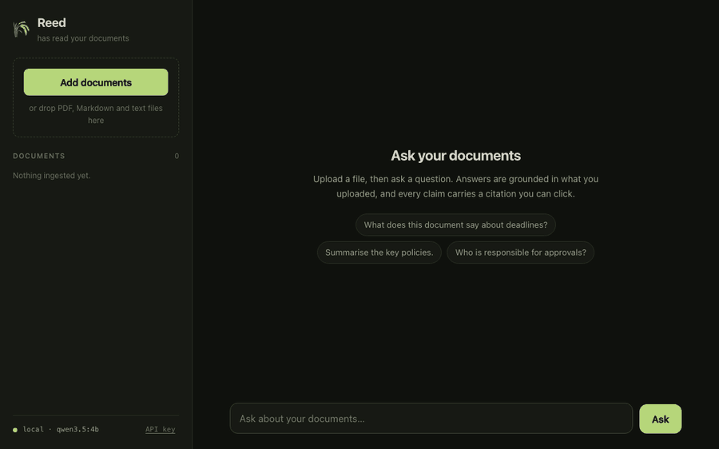
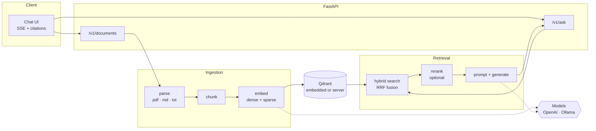

<div align="center">

# 🌾 Reed

**Reed has read your documents.**

A self-hosted RAG service: upload your files, ask questions, get streamed answers with citations
you can click. Runs on the OpenAI API — or entirely on your own machine, where nothing you upload
ever leaves it.

[](https://github.com/Ulzuhan/reed/actions/workflows/ci.yml)
[](https://github.com/Ulzuhan/reed/pkgs/container/reed)
[](https://www.python.org/)
[](https://docs.astral.sh/ruff/)
[](https://mypy-lang.org/)
[](LICENSE)



</div>

---

## Why this exists

Most RAG demos stop at "it answered something". The interesting problems start after that: does it
answer from the documents or from the model's memory, does it admit when the documents are silent,
does it find the right passage when the question does not share vocabulary with the answer, and can
you prove any of it changed when you tune a parameter.

Reed is built around those questions. It ships a **hybrid retriever**, a **strict citation
contract**, and an **evaluation suite with a golden question set** so every change to chunking,
retrieval or prompting can be measured rather than guessed at.

## Features

- **Hybrid retrieval** — dense embeddings and BM25 sparse vectors searched together, fused by
  Qdrant with Reciprocal Rank Fusion. Paraphrases and exact terminology both find their passage.
- **Citations that mean something** — the model is instructed to mark every claim with `[n]`, and
  those numbers map to the exact chunks retrieved. The UI turns them into clickable chips.
- **Calibrated refusal** — when the documents do not answer the question, saying so is the correct
  behaviour, and the evaluation suite measures whether it happens.
- **Fully local mode** — with Ollama, no document, question or answer leaves your machine.
- **Token streaming** over Server-Sent Events, with sources delivered before the first token.
- **Built-in evaluation** — retrieval metrics that need no model at all, plus LLM-judged answer
  quality that can itself run locally.
- **Runs without Docker** — embedded Qdrant means `uv sync` and go. Or bring the compose stack.
- **Optional reranking** with a local ONNX cross-encoder when accuracy matters more than latency.

## How it works



Retrieval and generation are two explicit steps rather than an agent loop. For document question
answering that is the right trade: the flow is predictable, streams cleanly, and the evaluation
measures exactly the path users take.

## Quickstart — no Docker

You need [uv](https://docs.astral.sh/uv/) and, for the local profile,
[Ollama](https://ollama.com).

```bash
git clone https://github.com/Ulzuhan/reed.git && cd reed
uv sync
```

**Fully local** — nothing leaves your machine:

```bash
ollama pull qwen3.5:4b && ollama pull embeddinggemma
REED_PROFILE=local uv run reed serve
```

**With OpenAI**:

```bash
export OPENAI_API_KEY=sk-...
REED_PROFILE=openai uv run reed serve
```

Either way, open <http://localhost:8000>, drop in a PDF or Markdown file, and ask.

Qdrant runs embedded — a folder under `./data`, no server, no container. Ingest from the command
line instead of the browser with `uv run reed ingest ./my-docs/`.

## Quickstart — Docker

```bash
OPENAI_API_KEY=sk-... docker compose up
```

Or the fully local stack, with Ollama in the compose file too:

```bash
docker compose --profile ollama up -d
docker compose exec ollama ollama pull qwen3.5:4b
docker compose exec ollama ollama pull embeddinggemma
REED_PROFILE=local docker compose up -d
```

The published image is `ghcr.io/ulzuhan/reed:latest` (linux/amd64 and linux/arm64).

## API

Interactive documentation lives at `/docs`. If `REED_API_KEY` is set, every `/v1` route requires an
`X-API-Key` header.

| Method | Path | What it does |
|---|---|---|
| `GET` | `/health` | Status, active profile, model names, document count |
| `POST` | `/v1/documents` | Upload a PDF, Markdown or text file — returns `202` and ingests in the background |
| `GET` | `/v1/documents` | List documents with ingestion status and chunk counts |
| `GET` | `/v1/documents/{id}` | One document — poll this while it ingests |
| `DELETE` | `/v1/documents/{id}` | Remove a document and every chunk it produced |
| `POST` | `/v1/ask` | Ask a question — SSE stream by default, JSON with `"stream": false` |

Uploading the same content twice returns `409` with the existing document id: ingestion is
idempotent, keyed on the file's SHA-256.

### Streaming a question

```bash
curl -N -X POST http://localhost:8000/v1/ask \
  -H 'content-type: application/json' \
  -d '{"question": "What is the expense pre-approval threshold?"}'
```

```
event: meta
data: {"request_id":"r-a37fc81c6b3b","profile":"local","model":"qwen3.5:4b"}

event: sources                     ← retrieval finishes before generation starts,
data: {"sources":[{"n":1,"doc_id":"d-10d30e7a…","filename":"expenses.md",
       "page":null,"score":0.87,"snippet":"Expenses above 75 euros require…"}]}

event: token                       ← one per chunk from the model
data: {"t":"Expenses above 75 euros "}

: ping                             ← heartbeat, so proxies do not buffer the stream

event: done
data: {"answer":"Expenses above 75 euros require pre-approval [1].","latency_ms":2145,
       "context_chars":309}
```

The `n` in each source is the same number the model is told to cite with, which is what lets a
client render `[1]` as a link to the passage it came from.

## Evaluation

`eval/corpus/` holds a synthetic company handbook, and `eval/golden.jsonl` holds 30 questions with
reference answers and the documents that genuinely answer them — including `negative` questions the
handbook does not cover, where the correct behaviour is refusal.

```bash
uv run reed eval --retrieval-only    # no model needed at all
uv run reed eval --judge local       # judged by your own Ollama model
uv run reed eval --judge openai      # judged by the OpenAI API
```

**Retrieval metrics** are plain arithmetic over the ranked results:

- `hit@1` / `hit@k` — was an expected document retrieved at all, and was it first
- `MRR` — how highly the first correct document ranked
- full coverage — for multi-hop questions, whether *every* required document came back

**Generation metrics** each come from one structured-output call to a judge model:

- **faithfulness** — the share of the answer's claims that the retrieved excerpts actually support
- **answer relevancy** — whether the answer addresses the question asked
- **correctness** — agreement with the reference answer
- **context precision / recall** — how much of what was retrieved was useful, and how much of the
  reference answer retrieval managed to surface
- **correct refusals** — on `negative` questions, whether the model declined instead of inventing

RAGAS would be the usual choice here. It still depends on `langchain-community` and does not import
against the LangChain 1.x layout this project is built on, so the metrics are implemented directly
in [`src/reed/evals/judge.py`](src/reed/evals/judge.py) — about two hundred lines, no stack
downgrade, and a judge that can be a local model.

### Results

<!-- EVAL-TABLE -->
_Populated by `uv run reed eval --summary-row`._
<!-- /EVAL-TABLE -->

## Configuration

Every setting is a `REED_*` environment variable, or a line in `.env` (see
[`.env.example`](.env.example)). The ones that matter:

| Variable | Default | Notes |
|---|---|---|
| `REED_PROFILE` | `openai` | `openai`, `local` (Ollama) or `fake` (deterministic stubs, for tests) |
| `OPENAI_API_KEY` | — | Required by the `openai` profile |
| `REED_OPENAI_CHAT_MODEL` | `gpt-5-mini` | |
| `REED_OPENAI_EMBED_MODEL` | `text-embedding-3-small` | |
| `REED_OLLAMA_CHAT_MODEL` | `qwen3.5:4b` | |
| `REED_OLLAMA_EMBED_MODEL` | `embeddinggemma` | |
| `REED_QDRANT_URL` | — | Empty means embedded Qdrant under `REED_DATA_DIR` |
| `REED_TOP_K` | `4` | Chunks passed to the model |
| `REED_RERANK_ENABLED` | `false` | Cross-encoder reranking; downloads ~80 MB on first use |
| `REED_CHUNK_SIZE` / `REED_CHUNK_OVERLAP` | `1000` / `150` | Characters, not tokens |
| `REED_API_KEY` | — | Set to require `X-API-Key` on `/v1` routes |
| `REED_DATA_DIR` | `./data` | Uploads, embedded Qdrant and the document registry |

## Design decisions

**Two-step RAG, not an agent.** Retrieve then generate. Predictable latency, clean streaming, and
an evaluation that measures the same path production takes.

**The embedding dimension is probed, never hardcoded.** `text-embedding-3-small` is 1536,
EmbeddingGemma is 768. A collection built with one model and queried with another fails at startup
with an explanation, instead of returning quietly wrong neighbours.

**Chunk sizes in characters, not tokens.** Tokenization differs between providers; Reed has to chunk
identically whichever one is configured.

**Deterministic point ids.** A chunk's id is `uuid5(sha256_of_file : chunk_index)`, so re-ingesting
the same content overwrites the same vectors — including after a run that died halfway through.

**Embedded Qdrant for development.** The same client, the same API, the same hybrid queries as the
server, with nothing to install. The compose stack covers the server path, and CI exercises both.

**A hand-written UI.** No build step, no framework, no `node_modules` — the chat page is three
static files served by the API itself. It uses `fetch` and `ReadableStream` rather than
`EventSource`, because `EventSource` cannot POST or send an API key header.

## Development

```bash
make install     # uv sync
make dev         # autoreloading server
make lint        # ruff check + format check
make type        # mypy --strict
make test        # pytest (unit + integration against embedded Qdrant)
make eval        # the evaluation suite
```

Tests run on the `fake` profile: deterministic stub models, real Qdrant, real BM25 sparse vectors.
No API keys, no network, nothing to mock by hand.

## Roadmap

- Query rewriting for follow-up questions that depend on the previous turn
- OCR for scanned PDFs
- Multiple collections, so one deployment can serve separate document sets
- A task queue, for ingestion workloads larger than one process should handle

## License

MIT — see [LICENSE](LICENSE).

---

<div align="center">
Built by <a href="https://hesperialabs.com">Hesperia Labs</a> — local-first, privacy-first AI.
</div>
