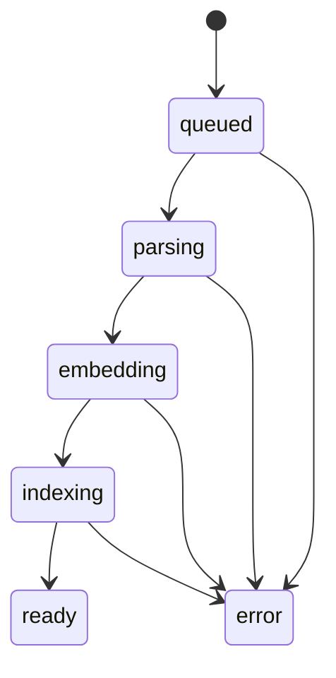

# Architecture

This document describes Reed's implementation boundaries. The [README](../README.md) is the
operator-facing overview and [runbooks](runbooks.md) cover procedures.

## Components

```text
src/reed/
├── cli.py             operator command line: serve, ingest, index, backup, eval
├── config.py          typed REED_* settings and model-aware presets
├── providers.py       OpenAI, Ollama and deterministic fake adapters
├── model_identity.py  immutable digest/revision/quantization resolution
├── services.py        lazy dependencies, bootstrap, bounded queue and locks
├── indexes.py         reindex, atomic activation, rollback and cleanup
├── backups.py         checksummed offline archive lifecycle
├── rerankers.py       optional reranker backends behind the `rerank` extra
├── observability.py   dependency-free Prometheus registry
├── log.py             logging setup that coexists with uvicorn's handlers
├── api/               FastAPI routes, early middleware and SSE
├── ingest/            isolated parsing, chunking, staging and publication
├── rag/               vector store, retrieval, diversity, prompts and generation
├── evals/             datasets, evidence metrics, judging and reports
└── static/            build-free chat/upload UI
```

Provider-specific construction stays in `providers.py`; consumers use LangChain core interfaces.
Expensive dependencies are created lazily by `Services`, so liveness never needs to open a model
client. The supported deployment is one Reed process: its SQLite registry, queue, semaphores,
metrics and embedded-store lock are process-local.

## Ingestion state machine



The API writes the original and a durable `queued` registry row before attempting to enqueue its
document id. A fixed-size `queue.Queue` applies backpressure and worker count is bounded by
`REED_MAX_CONCURRENT_INGESTIONS`. On startup, durable queued rows are refilled; rows stranded in an
active stage by a crash become explicit errors. Reed does not claim this protocol across multiple
processes.

The data path is:

```text
stream limits → SHA-256/dedup → retained original → isolated parse → sections → chunks
              → dense and sparse inference → staged upsert → committed payload → registry ready
```

Parsers produce citable sections before chunking — PDF pages, or the Markdown headings that
Markdown, DOCX and HTML extraction emit — so a chunk does not straddle PDF pages. Chunk sizes are characters because provider tokenizers differ. Dense input
adds filename/section metadata for retrieval while the stored `page_content` remains clean. Dense
and sparse inference happens outside the embedded-Qdrant lock; only database operations enter the
critical section.

Document and point ids are deterministic from content SHA-256. New points carry
`metadata.committed=false`; only a complete batch is published. Retrieval additionally requires
the matching SQLite row to be ready, closing the non-transactional window between Qdrant and
SQLite. Failed or interrupted attempts schedule document-filtered cleanup before the next search.

The parser is a spawned process with a wall-clock timeout and, on Linux, CPU, address-space and
file-descriptor limits. This is risk reduction, not a complete sandbox.

## Index generations

One logical collection maps to one active physical collection. The registry tracks generations in
`building`, `active`, `previous` or `failed` state. A fingerprint binds the physical vectors to:

- dense model name, immutable digest/revision, quantization and probed dimension;
- query/document task prefixes;
- sparse model;
- chunk size and overlap;
- the extraction pipeline version; and
- the fingerprint schema version.

An ordinary startup validates the active physical collection against the configured fingerprint.
`reed index reindex` instead builds a fresh candidate: it verifies every retained original's hash,
indexes the complete ready registry, checks exact committed counts, and atomically changes the
SQLite active pointer. The previous collection is untouched. Candidate failures are recorded and
their physical collection is deleted. Rollback requires a surviving collection with the exact
currently configured fingerprint; cleanup never deletes the active generation.

This separates tag mutability from index safety. Ollama tags resolve through `/api/tags` to a
digest and quantization before a collection is created or validated. Operators can explicitly pin
identity fields for hosted/custom providers.

## Vector store and retrieval

Each Qdrant collection has two named vectors:

| Vector | Source | Function |
|---|---|---|
| `dense` | configured embedding model | semantic/paraphrase retrieval |
| `sparse` | FastEmbed `Qdrant/bm25` | lexical/exact-term retrieval |

The index always stores both representations. Query views select `dense`, `sparse`, `hybrid` or
`hybrid_rerank` without rebuilding. Hybrid uses Qdrant Reciprocal Rank Fusion. Retrieval then:

1. removes chunks whose documents are not ready;
2. optionally reranks a larger candidate set through an isolated adapter;
3. greedily balances relevance and lexical novelty, with a per-document cap;
4. applies an evidence threshold valid for that score domain; and
5. fits the final chunks to the prompt's character budget.

The automatic threshold `0.8333333333333333` is enabled only for local EmbeddingGemma, hybrid RRF and no
reranker—the exact v0.3 calibration domain. Dense similarities, sparse scores and cross-encoder
scores are deliberately not treated as interchangeable.

Embedded and remote Qdrant use the same client/query API. Embedded mode is serialized because its
in-process structures are not safe for concurrent mutation. Remote Qdrant does its own
concurrency control. Evaluations always use a temporary embedded path so they cannot collide with
a running service.

## Generation and citation contract

Retrieved excerpts are serialized as untrusted JSON in a user message, never interpolated into the
system message. The model is instructed to answer only from numbered excerpts, cite every factual
claim with `[n]`, and refuse when the evidence is absent. Short conversational follow-ups may use
the most recent user question for retrieval without carrying unrelated topics forward.

The answer path is one async generator shared by SSE, JSON and evaluation:

```text
SourcesEvent → TokenEvent* → DoneEvent
                         ↘ ErrorEvent
```

Retrieval and reranking run in worker threads. SSE uses a bounded queue and heartbeat comments —
including while the stream is queued behind `REED_MAX_CONCURRENT_ASKS`, because the response and
its `meta` event are already committed by then and a silent stream is one a reverse proxy drops.
Stopping the client cancels generation cooperatively, and a stream abandoned mid-queue gives back
the slot it was waiting for. Final citation auditing checks source range,
sentence coverage, cited numbers and verbatim quotes and exposes warnings to both API and UI.

## Evaluation

Package data contains the same 10-document corpus, 41-question golden set and exact evidence
sidecar as the repository-level editable fixtures. The runner ingests through the production
pipeline into a temporary store, executes the selected production retrieval mode and optionally
uses the production generation stream.

Evidence labels are normalized verbatim excerpts rather than only document names. Retrieval
reports Recall@k, nDCG@k, MRR, full evidence/multi-hop coverage, negative abstention and abstention
accuracy. Threshold calibration maximizes balanced positive/negative accuracy. Confidence
intervals use a deterministic 1,000-draw bootstrap with seed 0.

Judged metrics use structured outputs, bounded concurrency and an exact-input cache. Failed calls
are unscored and uncached. Reports include exact chunks/scores/evidence, citations and warnings plus
dataset hashes, git SHA, package/runtime versions, hardware, configuration and immutable model
identity. This makes a report a reproducible experiment record rather than a summary row.

## Operations and observability

`/health` remains a cheap liveness probe. `/ready` tracks vector bootstrap and a cached local
Ollama chat probe without exposing internal endpoints. Provider bootstrap is single-flight with
bounded exponential backoff. Metrics cover request outcomes, upload rejection, ingestion stages,
queue depth, retrieval latency and abstentions; authenticated deployments protect `/metrics` with
the same key.

Offline backups archive `REED_DATA_DIR` with a manifest and per-file SHA-256. Verification precedes
restore, and restore stages inside the empty target and promotes the extracted entries one level up:
under the shipped Compose file `REED_DATA_DIR` is a volume mountpoint, so a scratch directory beside
it would land on the read-only container root. Remote Qdrant is outside this archive and needs its
own coordinated snapshot.

## Testing and release gates

The fake profile supplies deterministic dense/chat models while integration tests use real
embedded Qdrant and FastEmbed BM25. Tests cover queue recovery/backpressure, two-phase publication,
index failure/rollback, citation behavior, unsafe backup members, API/UI behavior and packaging.

CI runs Ruff, strict mypy, Python 3.11–3.13 tests, branch coverage, dependency/history scans,
Chromium E2E, image scanning and Compose upload-to-answer smoke tests. The release workflow first
reuses the complete quality gate, verifies that the tag version matches `pyproject.toml` and that
the tag is the current `origin/main`, builds from the sdist, installs the wheel in an empty
directory, runs retrieval-only evaluation, and publishes only after those checks pass.
